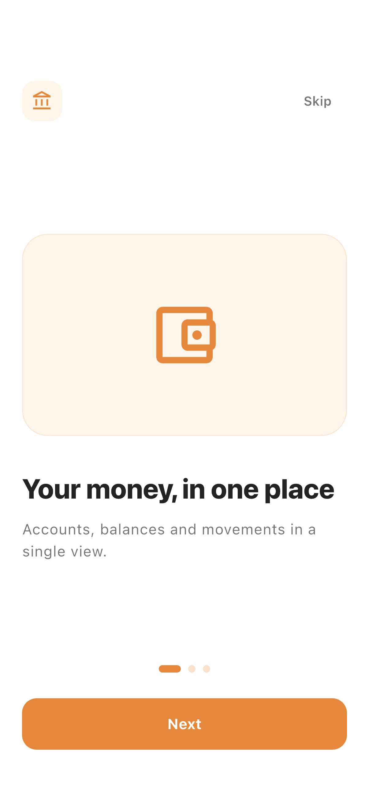
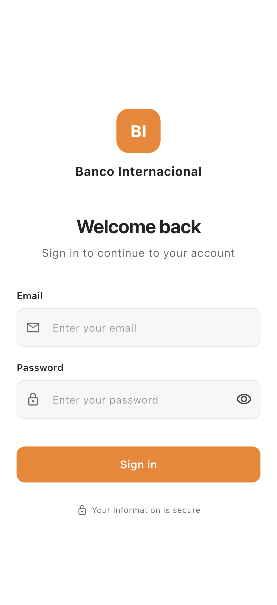
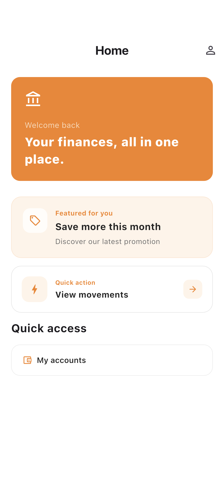
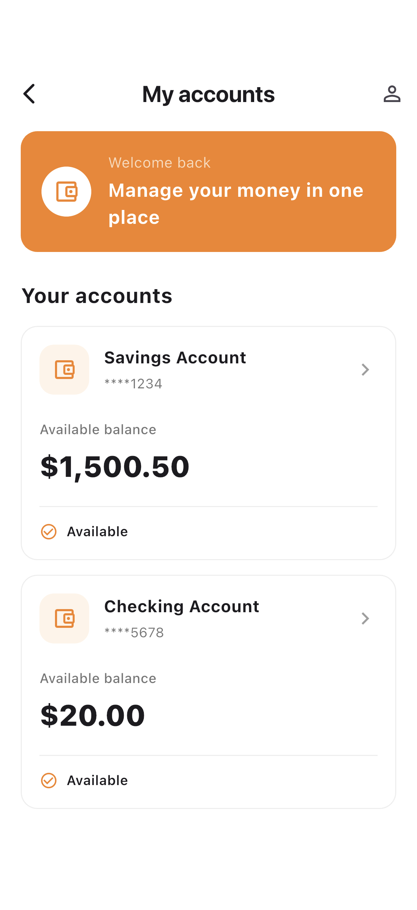
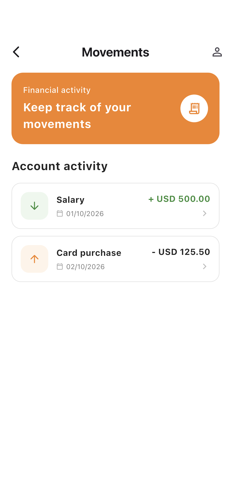

# Flutter Digital Bank

Flutter implementation for the Senior Front-End Technical Assessment.

## Project Status

Current phase: Final validation and delivery

Authentication, Accounts (accounts, available balances), Movements
(transaction history and detail), and Dynamic Experience (remotely configured,
schema-controlled experience composed on Home) are implemented and integrated
into the application. Shared error handling, development logging, and production
observability are implemented as cross-cutting foundations. The Flutter
application consumes the NestJS backend through a shared API client with
centralized in-memory session management and Bearer authentication. The
implementation was developed incrementally using Specification-Driven
Development (SDD) and Test-Driven Development (TDD), and the project is now in
final validation and delivery.

PR21 — Minimum Viable Onboarding is implemented: a first-run onboarding (three
steps, Next/Skip) is shown before authentication and its completion is persisted
locally, so the startup routing gate skips it on later launches.

PR22 — Final Delivery documents the engineering delivery: AI-assisted
development, deployment and operations, accessibility evidence, and the visual
evidence strategy. Screenshot automation and CI artifacts were documented as a
strategy at that point and implemented later: PR25 implements the screenshots
(`E2E-VIS-001`), while CI artifact publication remains future work.

Implemented customer journey:

```text
Onboarding -> Login -> Home -> Dynamic Experience -> Accounts -> Movements
```

| Onboarding | Login | Home |
|---|---|---|
|  |  |  |

| Dynamic Experience | Accounts | Movements |
|---|---|---|
|  |  |  |

> These screenshots are generated automatically by `E2E-VIS-001`
> (`integration_test/screenshots_capture_test.dart`), which walks the journey
> above against the controlled local HTTP server. Regenerate them on a booted
> iOS simulator or Android device with:
>
> ```bash
> flutter drive \
>   --driver=test_driver/integration_test.dart \
>   --target=integration_test/screenshots_capture_test.dart \
>   -d <device-id>
> ```
>
> The command writes `screenshots/01_onboarding.png` through
> `screenshots/06_movements.png`.

The customer journey runs against the NestJS backend. Login obtains a JWT that
is stored in an in-memory session; a shared Dio interceptor attaches
`Authorization: Bearer <token>` to protected requests. A `401` clears the
session and returns the user to login.

Current milestones:

```text
PR18 — Flutter to NestJS API Integration   Merged
Navigation Flow Fix                        Merged
PR19 — External Service Integration        Merged
PR20 — Resilience & Degraded State         Merged
PR21 — Minimum Viable Onboarding           Merged
PR22 — Final Delivery                      Merged
PR23 — Final Quality & Evidence            Merged
PR24 — Final Validation & Delivery         Merged
PR25 — Visual Evidence Capture             Merged
```

PR25 — Visual Evidence Capture materializes the visual evidence strategy
deferred by PR22 and PR24. `E2E-VIS-001`
(`integration_test/screenshots_capture_test.dart`) walks the customer journey
against the controlled local HTTP server and a driver
(`test_driver/integration_test.dart`) writes the six screenshots committed under
`screenshots/`. No product behavior is changed.

Navigation preserves a back history across Home, Accounts, Movements, and
Movement detail. The View Movements quick action opens Accounts in an explicit
account-selection mode (`Select an account`) before Movements, because the
movements screen requires a selected account.

Firebase Cloud Messaging (FCM) is integrated as the external service on
Android. The Flutter app requests notification permission, obtains and refreshes
the FCM registration token, and registers the device installation with the
NestJS backend. The backend sends a notification (dynamic title/body) through
the Firebase Admin SDK while preserving routing data (`type`, `movementId`),
and tapping the notification navigates to Movements. This flow was implemented
and validated on a physical Android device.

PR20 — Resilience & Degraded State is implemented across the core network
boundary and the product features: a bounded retry policy (at most 2 retries /
3 attempts, exponential backoff 300 ms → 600 ms), an in-memory read cache with a
shared `Read<T>` (remote/cache) contract, a connectivity abstraction, explicit
stale/degraded states with user-initiated recovery, failure isolation for
Experience (Home stays usable), and observability of retry/degraded behavior.
These capabilities cover REQ-006 (limited connectivity), REQ-007 (high
latency), REQ-008 (partial service unavailability), and REQ-009 (loading,
retry, cache, and recovery states).

## Requirements

- Flutter 3.47.4
- Dart 3.13.3

## Getting Started

Install dependencies:

```bash
flutter pub get
```

Run the application:
```bash
flutter run
```

The API base URL is provided at build time and defaults to no value:

```bash
flutter run --dart-define=API_BASE_URL=http://localhost:3000
```

`API_BASE_URL` points to the NestJS backend. The backend is not required to run
the unit and widget test suite.

## Engineering Approach

The project is developed incrementally using a requirement-driven and decision-oriented approach.

The implementation follows this progression:

1. Technical requirements
2. MVP scope and prioritization
3. Application architecture
4. Application foundation
5. Core product features
6. Resilience and degraded-state handling
7. Personalization and dynamic experiences
8. External service integration
9. Testing and quality validation
10. Observability and operations
11. Final validation and documentation

Development follows Specification-Driven Development (SDD) and Test-Driven Development (TDD), with AI used as an engineering assistant throughout the development lifecycle.

Each feature starts with an explicit specification covering requirements, contracts, scenarios, and tasks. Implementation then follows TDD through domain, infrastructure, presentation, integration, and end-to-end validation.

Each significant change is specified, implemented, tested, and validated before being integrated into the trunk.

Architectural decisions and significant technical trade-offs are documented as Architecture Decision Records (ADRs).

## Documentation

### Product

- [Requirements Traceability](docs/product/requirements-traceability.md)  
  Maps the technical assessment requirements to product scope, architecture decisions, implementation, tests, documentation, and verification evidence.

- [MVP Scope and Prioritization](docs/product/scope-and-prioritization.md)  
  Defines the MVP journey, implementation priorities, scope boundaries, deferred capabilities, and requirement-to-scope mapping.

### Features

Feature specifications are maintained alongside each feature under
`lib/features/<feature>/spec/`.

- `lib/features/auth/spec/`
- `lib/features/accounts/spec/`
- `lib/features/movements/spec/`
- `lib/features/experience/spec/`
- `lib/features/onboarding/spec/`
- `lib/features/notifications/spec/`

Documentation will be added progressively as the corresponding engineering decisions and implementation work are completed.

### Architecture

- [Architecture](docs/architecture/README.md)
  Defines the application structure, dependency boundaries, SDD/TDD workflow,
  and initial architectural decisions.

- [ADR-004 — Resilience Policy](docs/architecture/adr/004-resilience-policy.md)
  Defines the concrete retry, cache, connectivity, and degraded-state policy
  implemented on top of the boundaries established by ADR-003.

- [ADR-005 — Dynamic Personalization](docs/architecture/adr/005-dynamic-personalization.md)
  Defines the remotely configured, schema-controlled experience composed at
  runtime on Home (supported sections, controlled intents, and scope boundaries).

- [ADR-009 — Observability and Monitoring](docs/architecture/adr/009-observability-and-monitoring.md)
  Defines the provider-agnostic observability seam, event taxonomy, severity
  model, and sensitive-data telemetry policy.

- [PR12 — Error Handling and Development Logging](docs/architecture/pr12-error-handling-and-development-logging.md)
  Defines the shared error model, `Result<T>`, the error mapping boundary, the
  development logging seam, sensitive-data logging constraints, and the
  Auth/Accounts migration.

- [PR14 — Production Observability](docs/architecture/pr14-production-observability.md)
  Defines the provider-agnostic observability seam (`IObservability`), the event
  taxonomy, the sensitive-data policy, and the Auth/Accounts reporting migration.

- [PR18 — Flutter to NestJS API Integration](docs/architecture/pr18-api-integration.md)
  Defines the in-memory session, the centralized Bearer authentication, the 401
  handling, and the validated integration against the NestJS backend.

- [PR19 — External Service Integration](docs/architecture/pr19-external-service-integration.md)
  Defines the Firebase Cloud Messaging integration on Android, the device
  registration, the NestJS Firebase Admin delivery, the notification
  navigation, and the safe CI validation without credentials.

- [PR20 — Resilience & Degraded State](docs/architecture/pr20-resilience.md)
  Defines the bounded retry policy, the in-memory read cache and `Read<T>`
  fallback, the connectivity abstraction, and the explicit stale/degraded
  states for Accounts, Movements, and Experience.

Additional documentation will be added progressively as the corresponding engineering decisions and implementation work.

### Operations

- [Operations](docs/operations/README.md)
  Defines the CI quality gate and the operational observability and monitoring
  strategy.

### Delivery

- [Final Delivery](docs/delivery/README.md)
  Defines the final delivery documentation area, the delivery pipeline, and the
  boundary between implemented capabilities and documented strategy.

- [AI-assisted Development](docs/delivery/ai-assisted-development.md)
  Documents AI usage, the SDD/TDD workflow, human review, and the qualitative
  impact, limits, and risks.

- [Deployment and Operations](docs/delivery/deployment-and-operations.md)
  Documents the implemented build, configuration, CI validation, and
  observability, and the deployment, release, and rollback strategy.

- [Accessibility Evidence](docs/delivery/accessibility-evidence.md)
  Records verified, partially evidenced, and not-yet-verified accessibility
  items.

- [Visual Evidence Strategy](docs/delivery/visual-evidence-strategy.md)
  Defines the customer-journey screenshots and `E2E-VIS-001` (implemented in
  PR25); the screenshot-to-artifact automation remains the target flow.

### Testing

Run the unit, widget, and integration-style tests:

```bash
flutter test
```

Run the end-to-end tests on a device or simulator:

```bash
flutter test integration_test/auth/authentication_flow_test.dart
flutter test integration_test/accounts/accounts_navigation_test.dart
flutter test integration_test/accounts/accounts_display_test.dart
flutter test integration_test/movements/movements_flow_test.dart
flutter test integration_test/experience/experience_flow_test.dart
flutter test integration_test/navigation/navigation_flow_test.dart
flutter test integration_test/onboarding/onboarding_flow_test.dart
```

If multiple devices or simulators are available, specify the target with `-d <device-id>`.

Regenerate the customer-journey screenshots used in this README:

```bash
flutter drive \
  --driver=test_driver/integration_test.dart \
  --target=integration_test/screenshots_capture_test.dart \
  -d <device-id>
```

The capture writes `screenshots/01_onboarding.png` through
`screenshots/06_movements.png`, driven by `E2E-VIS-001` against the controlled
local HTTP server.

The deterministic end-to-end tests run against a controlled local HTTP server and
cover the full journey (Login -> Accounts -> Movements -> Experience). They do not
require the NestJS backend.

An optional end-to-end test runs against the real NestJS backend and is skipped
unless a backend is reachable:

```bash
flutter test integration_test/api/real_backend_flow_test.dart \
  --dart-define=API_BASE_URL=http://localhost:3000
```

The test probes `API_BASE_URL` (default `http://localhost:3000`). When the backend
is not reachable the test skips; when it is reachable it runs the real
Login -> Home -> Accounts flow.

To require the real backend and fail instead of skipping, force it with a Dart
compile-time define (not a process environment variable):

```bash
flutter test integration_test/api/real_backend_flow_test.dart \
  --dart-define=API_BASE_URL=http://localhost:3000 \
  --dart-define=RUN_REAL_API_E2E=true
```

The notification navigation is covered by a deterministic end-to-end test:

```bash
flutter test integration_test/notifications/notification_flow_test.dart
```

CI validates the Flutter project (`flutter pub get`, `flutter analyze`,
`flutter test`, `flutter build apk --debug`) and the NestJS API against a
PostgreSQL 16 service (`npm ci`, `npm run build`, `npm run lint`, `npm run test`,
`npm run test:integration`, `npm run test:e2e`) without any Firebase credential.
A CI guard rejects committed private credentials (`service-account*.json`,
`*.p8`).

### AI

AI-assisted development is documented in
[AI-assisted Development](docs/delivery/ai-assisted-development.md): usage
across the SDD/TDD workflow, human review, and the qualitative impact, limits,
and risks.